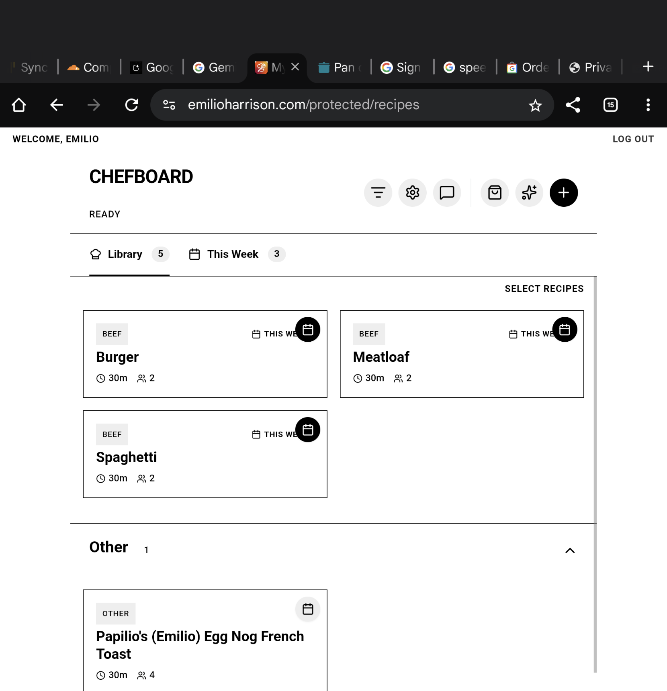

# Active Feedback Reports

> [!NOTE]
> This file is auto-generated by `scripts/sync-feedback.ts`. Do not edit manually.

## [BUG] - 12/26/2025, 6:05:54 PM
**ID**: `1766793954170` | **User**: `Unknown` | **Type**: 🔴 Bug

### Description
> **Actual**: The week selected icon for a recipe is not styled properly 
> **Expected**: The text and icon to be formatted properly 

<details>
<summary>Technical Context</summary>

- **URL**: https://emilioharrison.com/protected/recipes
- **User Agent**: `Mozilla/5.0 (Linux; Android 10; K) AppleWebKit/537.36 (KHTML, like Gecko) Chrome/143.0.0.0 Safari/537.36`

**Recent Logs**:
```
[INFO] Session started at 2025-12-27T00:05:54.170Z
[INFO] App version: 1.2.0
```

**App State**:
```json
{"recipes":[{"id":"1766684651408","title":"Megan stinky test","servings":2,"prepTime":15,"cookTime":15,"ingredients":[{"name":"","amount":"Stokl","prep":""},{"name":"","amount":"Poop","prep":""}],"steps":["Mix poop","Swerve"],"notes":"","protein":"Chicken","difficulty":"Hard","thisWeek":false,"updatedAt":"2025-12-26T16:40:04.276Z","isFavorite":true},{"id":"1766694159747","title":"Papilio's (Emilio) Egg Nog French Toast","servings":4,"prepTime":15,"cookTime":15,"ingredients":[{"name":"loaf French bread, sliced into 3/4-inch slices","amount":"1","prep":""},{"name":"eggs","amount":"5","prep":""},{"name":"cup mil1/2 cup egg nog","amount":"1","prep":""},{"name":"cup brown sugar","amount":"1/3","prep":""},{"name":"tsp vanilla","amount":"2","prep":""},{"name":"shot rum","amount":"1","prep":""},{"name":"tsp nutmeg","amount":"1/2","prep":""},{"name":"pinch salt","amount":"1","prep":""},{"name":"tbsp butter (for the skillet)","amount":"2-3","prep":""},{"name":"sugar (optional)","amount":"Powdered","prep":""}],"steps":["Prepare the Custard: In a wide, shallow bowl, whisk together the eggs, milk, sugar, vanilla, rum extract, and nutmeg until well blended.","Heat the Skillet: Place a large skillet or griddle over medium-low heat and melt 1 tablespoon of butter.","Soak the Bread: Dip each slice of bread into the egg mixture for about 10–15 seconds per side. Ensure the bread is saturated but still holds its shape.","Cook: Place the soaked slices into the skillet. Cook for 3–4 minutes per side until golden brown and the center is set.","Batch Cook: Repeat with the remaining slices, adding more butter to the pan as needed.","Finish: Sprinkle with powdered sugar if desired and serve warm."],"notes":"Papilio's (Emilio) Egg Nog French Toast\nServings: 4-6\nPrep Time: 10 minutes\nCook Time: 15 minutes\n\nIngredients\n * 1 loaf French bread, sliced into 3/4-inch slices\n * 5 eggs\n * 1 cup milk\n * 1/2 cup egg nog\n * 1/3 cup brown sugar\n * 2 tsp vanilla\n * 1 tsp rum extract\n * 1/2 tsp nutmeg\n * 1 pinch salt\n * 2-3 tbsp butter (for the skillet)\n * Powdered sugar (optional)\n\nInstructions\n * Prepare the Custard: In a wide, shallow bowl, whisk together the eggs, milk, sugar, vanilla, rum extract, and nutmeg until well blended.\n * Heat the Skillet: Place a large skillet or griddle over medium-low heat and melt 1 tablespoon of butter.\n * Soak the Bread: Dip each slice of bread into the egg mixture for about 10–15 seconds per side. Ensure the bread is saturated but still holds its shape.\n * Cook: Place the soaked slices into the skillet. Cook for 3–4 minutes per side until golden brown and the center is set.\n * Batch Cook: Repeat with the remaining slices, adding more butter to the pan as needed.\n * Finish: Sprinkle with powdered sugar if desired and serve warm.","protein":"Other","difficulty":"Easy"},{"id":"1766735641126","title":"Spaghetti ","servings":2,"prepTime":15,"cookTime":15,"ingredients":[{"name":"oz Spaghetti","amount":"16","prep":""},{"name":"jar sauce","amount":"1","prep":""}],"steps":["Boil spaghetti","Mix with sauce"],"notes":"","protein":"Beef","difficulty":"Easy","thisWeek":true},{"id":"1766735725535","title":"Meatloaf ","servings":2,"prepTime":15,"cookTime":15,"ingredients":[{"name":"pound ground beef","amount":"1","prep":""},{"name":"pinch seasoning","amount":"1","prep":""}],"steps":["Mix it","Cook it"],"notes":"","protein":"Beef","difficulty":"Medium","thisWeek":true},{"id":"1766735915351","title":"Burger","servings":2,"prepTime":15,"cookTime":15,"ingredients":[{"name":"patties of ground meat like beef","amount":"200","prep":""}],"steps":["Do the dang thing "],"notes":"","protein":"Beef","difficulty":"Easy","thisWeek":true},{"id":"1766792618389","title":"Eggs","servings":2,"prepTime":15,"cookTime":15,"ingredients":[{"name":"eggs","amount":"89","prep":""},{"name":"tbls butter","amount":"2","prep":""},{"name":"stink of fart","amount":"1","prep":""}],"steps":["Mix it up","Do it hard","Smell the fart"],"notes":"","protein":"Other","difficulty":"Easy","rating":0,"isFavorite":false,"createdAt":"2025-12-26T23:43:38.389Z","updatedAt":"2025-12-26T23:44:39.372Z","versionHistory":[{"date":"2025-12-26T23:44:39.372Z","changeType":"create"}]}],"selectedRecipe":null,"sort":"protein","filters":{}}
```
</details>

### Screenshot


---

