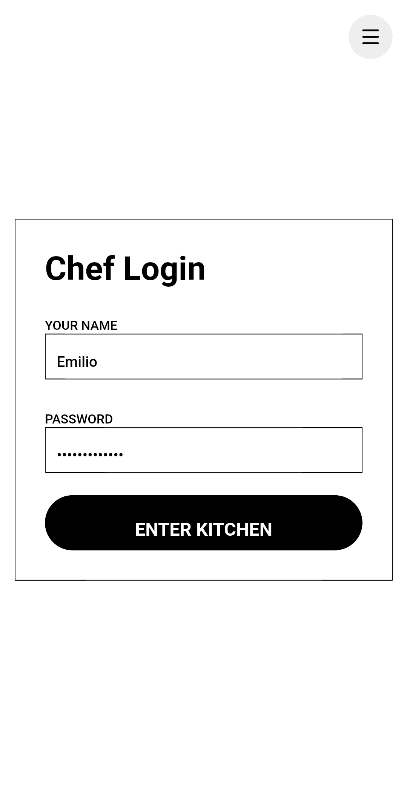
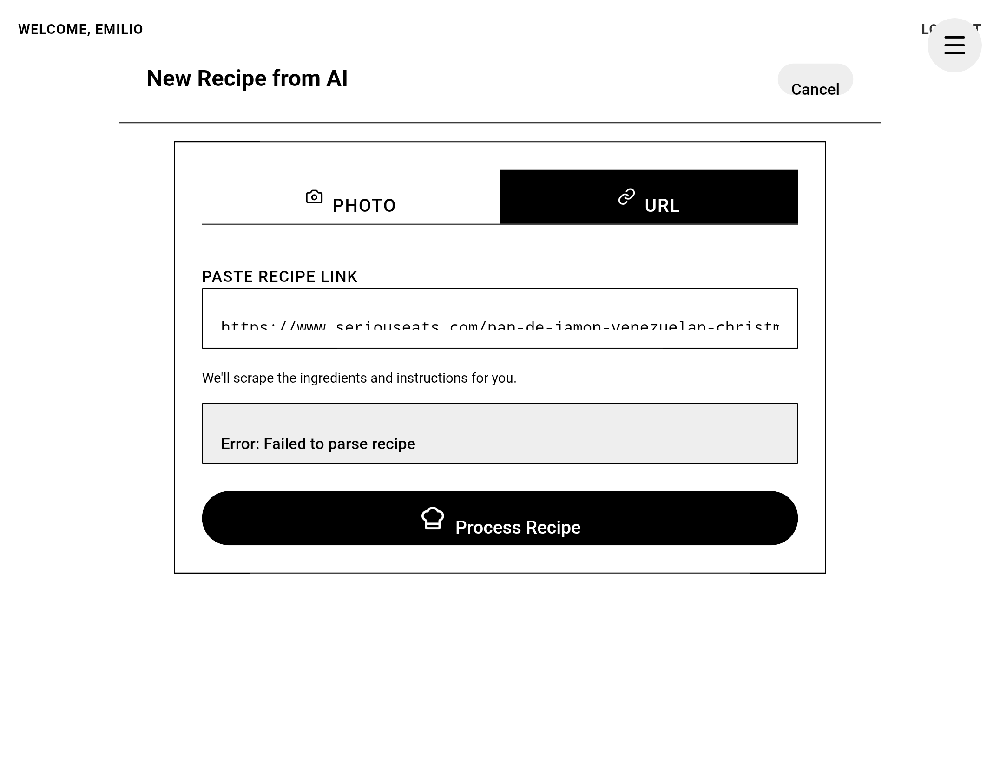
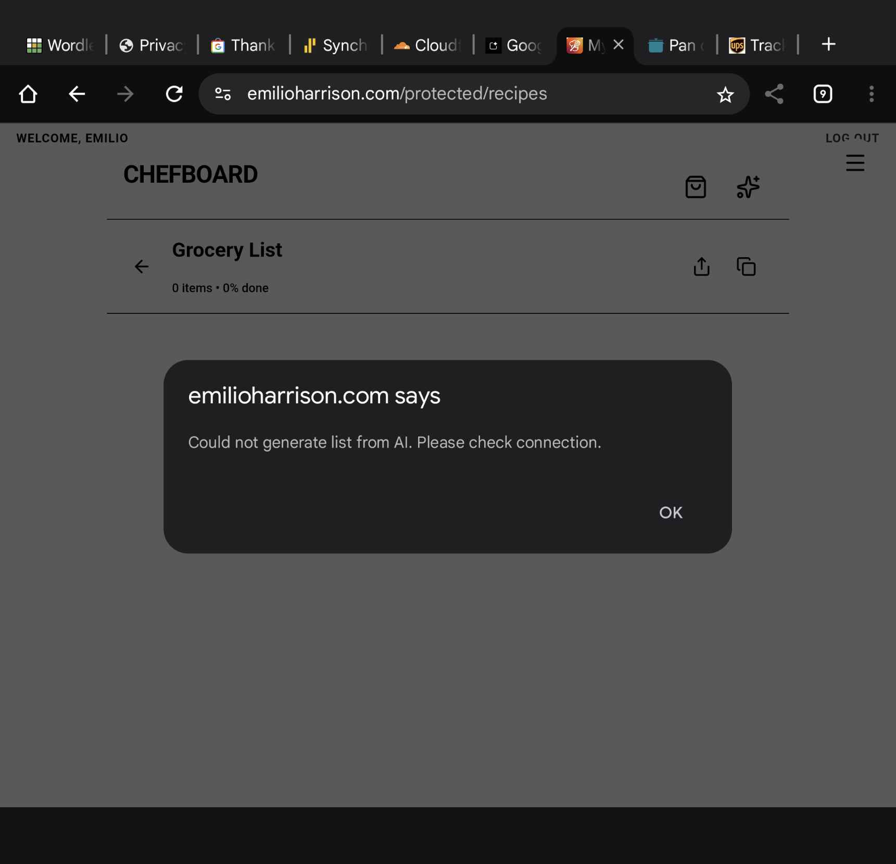
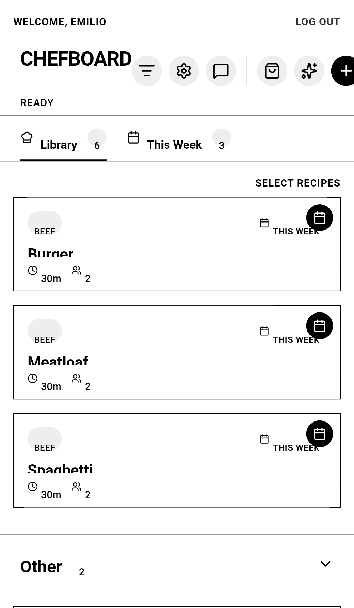

# All Feedback Reports

> [!NOTE]
> This file is auto-generated by `scripts/sync-feedback.ts`. Last synced: 12/27/2025, 8:35:27 PM

## [🔴 OPEN] BUG - 12/27/2025, 5:51:49 PM
**ID**: `1766879509556` | **User**: `Unknown`

### Description
> **Actual**: Tried to save recipe with image but it failed. 
> **Expected**: I expected to save recipe. 

<details>
<summary>Technical Context</summary>

- **URL**: undefined

**Recent Logs**:
```json
[]
```

</details>

### Screenshot


---

## [🔴 OPEN] BUG - 12/27/2025, 1:16:33 PM
**ID**: `1766862993312` | **User**: `Emilio`

### Description
> **Actual**: When I press the back button on my phone it takes me to login screen. 
> **Expected**: I expected it to take me to the previous screen

<details>
<summary>Technical Context</summary>

- **URL**: https://emilioharrison.com/protected/recipes/login

**Recent Logs**:
```json
[]
```

</details>

### Screenshot


---

## [🔴 OPEN] BUG - 12/27/2025, 12:36:23 AM
**ID**: `1766817383377` | **User**: `Emilio`

### Description
> **Actual**: I sent a recipe link to the app and got an error. 
> **Expected**: I expected the app to generate a full recipe that would be added to my recipe library 

<details>
<summary>Technical Context</summary>

- **URL**: https://emilioharrison.com/protected/recipes

**Recent Logs**:
```json
[]
```

</details>

### Screenshot


---

## [🔴 OPEN] BUG - 12/27/2025, 12:35:14 AM
**ID**: `1766817314682` | **User**: `Emilio`

### Description
> **Actual**: Attempted to create grocery list and got an error
> **Expected**: I expected the app to generate a grocery list of combined ingredients from the recipes that are selected for this week. 

<details>
<summary>Technical Context</summary>

- **URL**: https://emilioharrison.com/protected/recipes

**Recent Logs**:
```json
[]
```

</details>

### Screenshot


---

## [🔴 OPEN] BUG - 12/26/2025, 8:56:53 PM
**ID**: `1766804213392` | **User**: `Unknown`

### Description
> **Actual**: When I select a recipe from the recipe library to add to the week recipes the visual indicator on the recipe card is poorly laid out with text overlapped with the icon 
> **Expected**: I expected the content to be laid out well so that's it's easy to read. 

<details>
<summary>Technical Context</summary>

- **URL**: https://emilioharrison.com/protected/recipes

**Recent Logs**:
```json
[]
```

</details>

### Screenshot


---

